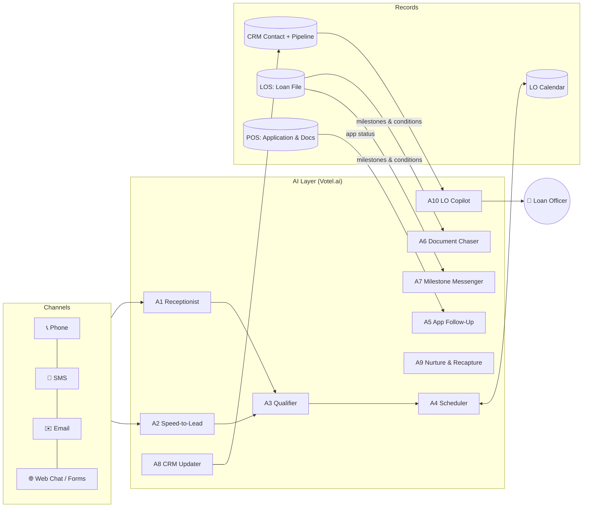
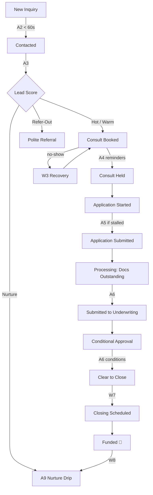

<div align="center">

# 🏡 Loan Officer AI Workflows

### The open blueprint for an AI receptionist + back-office admin team for residential mortgage loan officers

**Answer every inquiry in seconds. Qualify every lead the same fair way. Book the calendar. Chase every document. Update every borrower. Automatically.**

[](LICENSE)
[](docs/compliance-guardrails.md)
[](agents/)
[](workflows/)
[](templates/)

[Quick Start](#-quick-start) · [Architecture](#-architecture) · [Agents](#-the-ai-team) · [Workflows](#-workflows) · [Compliance](#-compliance-guardrails) · [Roadmap](#-build-roadmap)

</div>

---

## 💡 Why this exists

Loan officers don't lose deals because they can't do loans. They lose deals to **admin friction**:

| The problem | What it costs |
|---|---|
| Leads wait hours for a callback | Contact rates collapse after the first few minutes |
| Applications get started and abandoned | Pipeline that never becomes revenue |
| Processors chase paystubs by hand | Hours per file, delayed closings |
| Borrowers and agents call asking "where are we?" | Interrupted days, frustrated referral partners |
| Consults get no-showed with no recovery | Wasted calendar and lost buyers |
| Past clients are forgotten | Refinance and referral business left on the table |
| CRM records are half-empty | No visibility, no follow-up, no reporting |

This repository is a **complete, production-minded blueprint** for fixing all of it with a coordinated team of AI agents, workflows, templates, and CRM structures, built **compliance-first** for the realities of residential lending (SAFE Act, TRID, TCPA, ECOA, GLBA).

> Most "AI receptionist" templates stop at booking the appointment. This system keeps going through application follow-up, document collection, milestone updates, closing coordination, and post-close recapture, which is where loan officers actually lose their time.

---

## ✨ What's inside

| Folder | Contents |
|---|---|
| [`agents/`](agents/) | 10 paste-ready AI agent system prompts (A1 to A10) with guardrails, data capture, escalation rules, and tests |
| [`workflows/`](workflows/) | 9 detailed workflow specs (W1 to W9): triggers, timing, branches, SLAs, field updates |
| [`templates/`](templates/) | SMS, email, and voice script library with merge tokens and compliance footers |
| [`checklists/`](checklists/) | Machine-readable document checklists by loan type, income type, and common conditions |
| [`crm/`](crm/) | Custom fields, tags, and pipeline definitions as JSON, ready to import or recreate |
| [`integrations/`](integrations/) | LOS, POS, calendar, and lead-source mappings with sample webhook payloads |
| [`dashboards/`](dashboards/) | KPI definitions, formulas, and targets |
| [`tests/`](tests/) | 30-scenario test-call matrix and transcript QA rubric |
| [`docs/`](docs/) | Architecture, compliance, pipeline, deployment, onboarding, and the Claude Project instructions |
| [`packaging/`](packaging/) | Offer tiers and client onboarding kit for agencies and consultants |
| [`scripts/`](scripts/) | Validation and checklist-builder utilities (Python, no dependencies) |

---

## 🏗 Architecture



**Ownership rules:** the CRM owns conversations, consent, scheduling, and pipeline stage. The LOS owns the loan file, disclosures, and official milestones. The POS owns the formal application and documents. When they disagree, the LOS milestone wins.

Read more: [`docs/architecture.md`](docs/architecture.md)

---

## 🤖 The AI team

| ID | Agent | Channel | Job |
|---|---|---|---|
| A1 | [Receptionist](agents/a1-receptionist/) | Voice, chat | Answers 24/7, handles FAQs, qualifies, books, routes |
| A2 | [Speed-to-Lead](agents/a2-speed-to-lead/) | Outbound voice + SMS | Contacts new leads in under 60 seconds |
| A3 | [Qualifier](agents/a3-qualifier/) | Subagent | Standardized, fair qualification and lead scoring |
| A4 | [Scheduler](agents/a4-scheduler/) | Subagent | Books, confirms, reschedules, recovers no-shows |
| A5 | [Application Follow-Up](agents/a5-app-follow-up/) | SMS, email, voice | Gets started applications submitted |
| A6 | [Document Chaser](agents/a6-document-chaser/) | SMS, email, voice | Collects every doc and condition by its SLA |
| A7 | [Milestone Messenger](agents/a7-milestone-messenger/) | SMS, email | Proactive updates to borrowers, agents, and title |
| A8 | [CRM Updater](agents/a8-crm-updater/) | Background | Summaries, fields, tags, stages after every touch |
| A9 | [Nurture & Recapture](agents/a9-nurture-recapture/) | Email, SMS | Long-term nurture, past-client care, rate-watch |
| A10 | [LO Copilot](agents/a10-lo-copilot/) | Internal | Daily brief and next-best-action list for the LO |

---

## 🔁 Workflows

| ID | Workflow | Trigger |
|---|---|---|
| W1 | [Inbound Loan Inquiry](workflows/w1-inbound-inquiry.md) | Inbound call, chat, or form |
| W2 | [Lead Qualification](workflows/w2-lead-qualification.md) | Called by A1/A2 |
| W3 | [Appointment Scheduling & No-Show Recovery](workflows/w3-appointment-scheduling.md) | Qualified lead |
| W4 | [Application Follow-Up](workflows/w4-application-follow-up.md) | App started, not submitted |
| W5 | [Document Collection & Conditions](workflows/w5-document-collection.md) | Needs list or conditions change |
| W6 | [Milestone Updates](workflows/w6-milestone-updates.md) | LOS milestone change |
| W7 | [Closing Coordination](workflows/w7-closing-coordination.md) | Closing date set |
| W8 | [Post-Close & Recapture](workflows/w8-post-close-recapture.md) | Loan funded |
| W9 | [LO Daily Brief](workflows/w9-lo-daily-brief.md) | Every weekday 7:30 AM |

### Borrower journey



---

## 🛡 Compliance guardrails

Every asset in this repository is written to these rules. They are enforced in agent prompts and checked by [`scripts/validate.py`](scripts/validate.py).

1. **The AI is not a licensed loan originator.** It never quotes rates, APRs, payments, or fees, never promises approval, and never negotiates terms (SAFE Act).
2. **No accidental TRID application.** The AI never collects Social Security numbers. The formal application happens in the POS with the licensed LO.
3. **No sensitive data over SMS or email.** Documents go through a secure portal link only.
4. **TCPA consent first.** Outbound AI voice and marketing texts require prior express written consent. STOP is honored instantly.
5. **Quiet hours** by the contact's local time zone.
6. **AI and recording disclosure** at the start of every call.
7. **Fair lending.** One script, one scoring model, for every lead. No protected-class factors.
8. **No adverse action by AI.** Denials and counteroffers go to the LO.
9. **Wire-fraud warnings** on every closing communication.
10. **Human escalation** on complaints, rate questions, distress, and "talk to a person."

> ⚠️ **This repository is a framework, not legal advice.** Have the lender's compliance officer or counsel review scripts, templates, and consent language before going live. Full detail: [`docs/compliance-guardrails.md`](docs/compliance-guardrails.md)

---

## 🚀 Quick start

```bash
git clone https://github.com/qexa/loan-officer-ai-workflows.git
cd loan-officer-ai-workflows
python scripts/validate.py          # checks JSON + scans templates for compliance red flags
python scripts/build_checklist.py --loan-type va --income w2 self_employed --purpose purchase
```

Then follow the phased deployment guide:

1. **Foundation:** create fields, tags, and pipeline from [`crm/`](crm/). Start A2P 10DLC registration on day one.
2. **Front office:** deploy A1 to A4 from [`agents/`](agents/) and W1 to W3.
3. **Follow-up:** A5, A9, and the [`templates/`](templates/) library.
4. **Back office:** connect the LOS/POS via [`integrations/`](integrations/), then A6, A7, W5 to W7.
5. **Intelligence:** A8, A10, and [`dashboards/`](dashboards/).
6. **QA:** run all 30 scenarios in [`tests/call-scenarios.md`](tests/call-scenarios.md) before go-live.

Step-by-step platform guide: [`docs/deployment-votel.md`](docs/deployment-votel.md)

### Using this with Claude

Upload [`docs/claude-project-instructions.md`](docs/claude-project-instructions.md) as your Claude Project instructions and add the rest of the repo as project knowledge. Claude then acts as your architect and operator for this system: writing prompts, building workflows, drafting borrower messages, and summarizing calls.

---

## 🧩 Merge tokens

All templates share one token vocabulary:

`{first_name}` `{last_name}` `{lo_name}` `{lo_phone}` `{lo_nmls}` `{company_name}` `{company_nmls}` `{portal_link}` `{booking_link}` `{appt_date}` `{appt_time}` `{doc_list}` `{property_address}` `{closing_date}` `{title_company}` `{agent_name}` `{stage_plain_language}`

---

## 🗺 Build roadmap

| Phase | Weeks | Deliverables |
|---|---|---|
| 1. Foundation | 1–2 | Fields, tags, pipeline, number, A2P 10DLC, calendar sync, consent forms |
| 2. Front Office | 2–4 | A1–A4, W1–W3, reminders, no-show recovery |
| 3. Follow-Up | 4–5 | A5, A9, template library |
| 4. Back Office | 5–7 | LOS/POS integration, A6, A7, W5–W7 |
| 5. Intelligence | 7–8 | A8, A10, dashboards, rate-watch |
| 6. QA & Launch | 8–9 | Test suite, compliance review, 2-week pilot, go-live |
| 7. Productize | 10+ | Snapshot, onboarding SOP, offer tiers |

---

## 📊 Success metrics

Speed to lead **< 60s** · Show rate **> 80%** · Consult-to-application **> 60%** · Avg days docs outstanding **< 3** · Opt-out rate **< 2%**

See [`dashboards/kpis.md`](dashboards/kpis.md) for definitions and formulas.

---

## 🤝 Contributing

Loan officers, processors, compliance professionals, and automation builders are all welcome. See [CONTRIBUTING.md](CONTRIBUTING.md).

## 📄 License

[MIT](LICENSE) © 2026 Qexa Technology

<div align="center">

**Built by [Qexa Technology](https://qexa.com) · Powering [AutoAnswer.app](https://autoanswer.app)**

*Faster response. Fewer dropped balls. More loans closed.*

</div>
