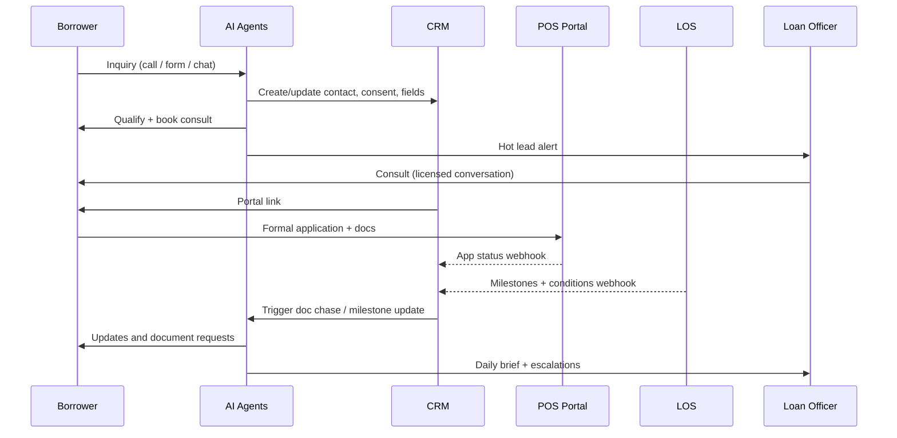

# Architecture

## Two layers, one record

| Layer | Agents | Scope |
|---|---|---|
| **Front office** | A1 Receptionist, A2 Speed-to-Lead, A3 Qualifier, A4 Scheduler, A5 App Follow-Up, A9 Nurture | First inquiry to submitted application, plus long-term nurture |
| **Back office** | A6 Document Chaser, A7 Milestone Messenger, A8 CRM Updater, A10 LO Copilot | Processing through funding, plus CRM hygiene and LO intelligence |

Both layers read and write **one contact record** and **one pipeline**. That shared record is what allows the system to stay connected with every applicant without anything falling through the cracks.

## System layers

| Layer | Component | Role |
|---|---|---|
| Channels | Inbound phone, outbound voice, SMS, email, web chat, forms, landing pages | Borrower and partner touchpoints |
| AI | Votel.ai AI agents and subagents | Conversations, qualification, summarization, extraction |
| CRM | Contacts, custom fields, tags, pipelines | Relationship source of truth |
| Scheduling | Bookables synced to Google or Outlook | Consults, reminders, reschedules |
| Automation | Workflows and scheduled tasks | Cadences, triggers, SLAs |
| Loan system of record | LOS (Encompass, Arive, LendingPad, Byte, etc.) | Loan file, disclosures, conditions, milestones |
| Application and docs | POS (Blend, Floify, Consumer Connect, Arive portal, etc.) | Formal application, secure upload, e-sign |
| Reporting | Dashboards | Funnel metrics, SLAs, AI performance |
| Glue | Webhooks, Zapier, Make, native connectors | Sync between systems |

## Data flow

## Ownership rules

1. **CRM owns** conversations, consent, scheduling, engagement data, and pipeline stage.
2. **LOS owns** the loan file, disclosures, conditions, and official milestones.
3. **POS owns** the formal application and document storage.
4. **On conflict, the LOS wins.** A milestone webhook always overwrites the CRM stage.
5. **Documents never live in the CRM.** The CRM stores only which items are outstanding, never the files.

## Failure handling

| Failure | Behavior |
|---|---|
| LOS webhook fails | Retry 3x with backoff; after that create a task for the processor and flag in A10 brief |
| Calendar sync fails | A4 stops offering slots, apologizes, creates a callback task |
| AI call fails / no answer | Fall back to SMS, then next scheduled attempt |
| Consent field missing | Skip outbound voice/SMS; email only if `email_opt_in`; else task for LO |
| Unknown intent | Offer to connect with the team; create task with transcript |
